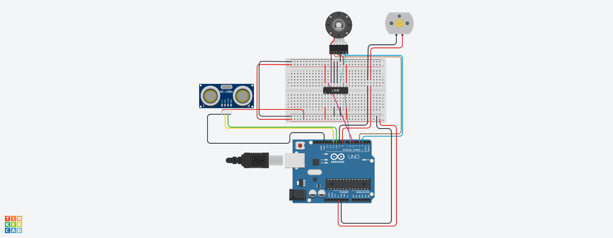

# MCS-RDD
All the Activities done during the MCS 7-week  Robotics Development and Design Program

# Branch Links
<a href="https://github.com/Optsipez/MCS-RDD.git" style="color: white; text-decoration: none; font-weight: bold; background-color: #0366d6; padding: 10px 15px; border-radius: 5px; box-shadow: 2px 2px 5px rgba(0,0,0,0.3);" onmouseover="this.style.backgroundColor='#ff6347'" onmouseout="this.style.backgroundColor='#0366d6'">Check out the repository</a>

# Arduino DC Motor Control with Ultrasonic Sensor

This project controls two DC motors (one with an encoder and one ordinary DC motor) based on the distance detected by an ultrasonic sensor. The project is implemented on an Arduino board using Tinkercad.

## Components Used

- Arduino Board
- DC Motor with Encoder
- Ordinary DC Motor
- Ultrasonic Sensor (HC-SR04)
- Connecting Wires
- Breadboard

## Pin Connections

### Motors
- Encoder Motor:
  - `motorA` connected to pin 5
  - `motorB` connected to pin 6
- Ordinary DC Motor:
  - `OLDCp` connected to pin 8
  - `OLDCm` connected to pin 9

### Ultrasonic Sensor
- `echoPin` connected to pin 10
- `trigPin` connected to pin 11

## Functionality

The ultrasonic sensor measures the distance of an object and controls the motors as follows:

- If the distance is less than 20 cm:
  - The encoder motor runs clockwise for 700 ms and then counterclockwise for 700 ms.
- If the distance is between 20 cm and 50 cm:
  - The ordinary DC motor runs clockwise for 700 ms and then counterclockwise for 700 ms.
- If the distance is greater than 50 cm:
  - All motors are stopped.

              *Wiring Diagram*
